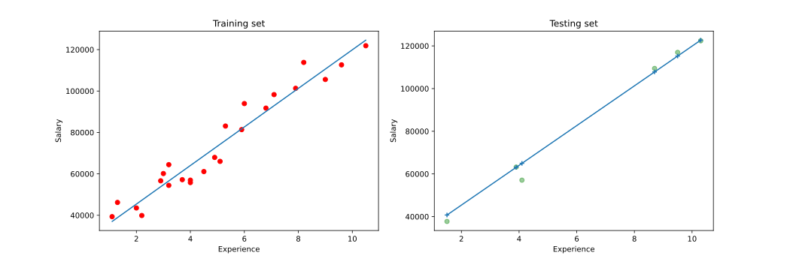

# Regression

## Simple Linear Regression

**One dependent & independent variable**

Simple linear regression is a simple straight line equation given by
```
an equation for a straight line
    y = mx + c

or in this case
    y = b0 + b1*c1

where 
 b0     -> is a constant
 y      -> is the dependent variable
 x      -> is the independent variable
```

Regression simply provides a straight line that best fits the data.

### Ordinary least square method

In this method the line that gives the lowest squared error is chosen.

1. Error is calculated as difference between the actual value and the predicted value
2. The errors from each point are squared and integrated 
3. The line with the lowest sum is chosen

### Linear Regression example
The dataset used here is the salary dataset.



## Multiple Linear Regression

Multiple linear regression includes a single dependent variable and multiple independent variables.
```
y = b0 + x1*b1 + x2*b2 + ... + xn*bn
```

> # Dummy Variables
> 
> While handling categorical data, care must be taken to not include anything more than what is actually necessary.
> 
> For instance, in cases where there are only two distinct items in a class, the second item can be safely discarded (without loosing data) as the lack of one means the existence of the other.
> ## Dummy Variable Trap
> In the above case, if we include both the dummy variables, the regression model will fail to distinguish between the effects of the two dummy variables.
> The lack of the a categorical class makes it the default class in the model and therefore needn't be included in the data used for training the model.
> 
> `y = b0 + ... + bn-1*(dummy1) + bn*(dummy2) `
>
> The b0 term includes the omitted item.
> The terms b0, bn and bn-1 should not all be present at the same time.
>> **Always omit one dummy variable**


